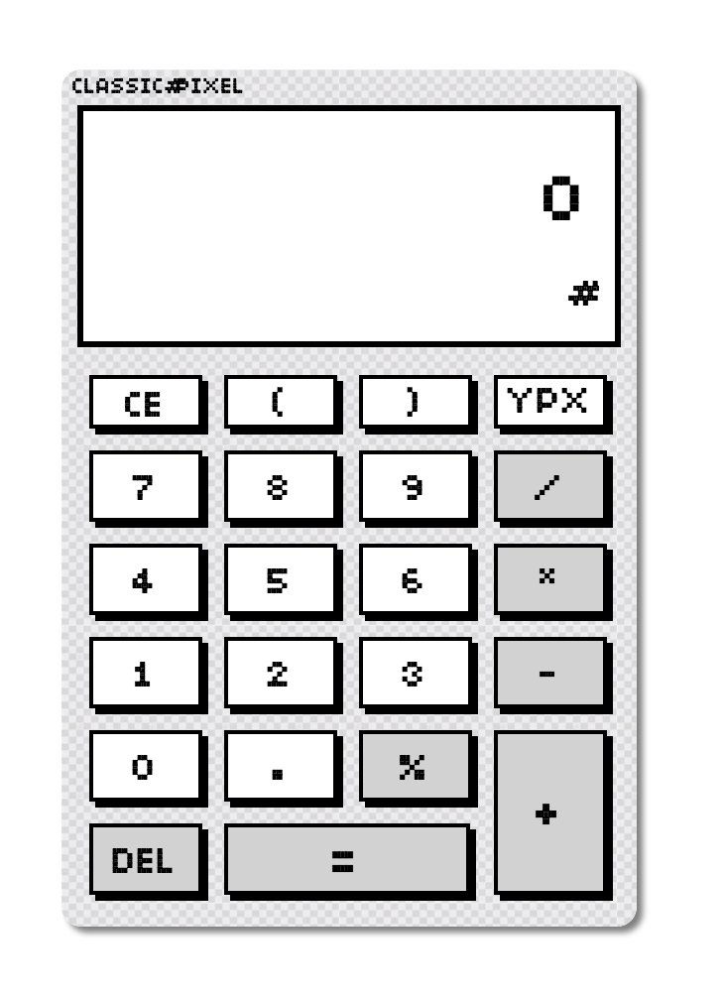
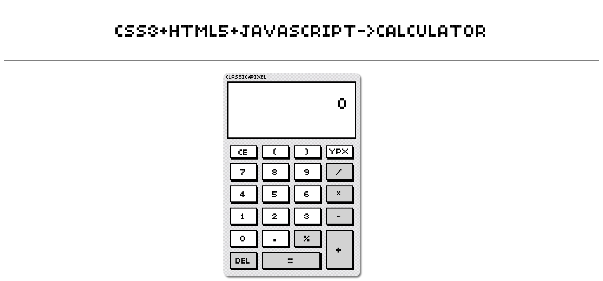

# 计算器
## 使用说明
### 界面
<image>
### 介绍
* 本计算器采用了经典的像素风格，支持基本的计算和即时显示功能
* 使用css3 html5 javascript开发
* 采用eval进行计算

####功能
#####右上角的YPX只是logo而已
* 用户按下“DEL”按钮，删除当前算术表达式最后一个字符，并更新显示
* 用户按下“CE”按钮，清除当前算术表达式
* 用户按下“=”按钮，计算当前表达式的结果并显示
* 算术表达式非法弹出警告框提醒用户，终止计算
* 支持加(+)、减(-)、乘(*)、除(/)、取模（%）、运算

### 不足
* 使用eval表达式存在一定代码入侵危险，只能屏蔽键盘输入，在功能上造成一定的缺陷
* 由于字体原原因，空白出现#号，故在input中使用了一处空value，导致一个地方未能通过w3c html5验证

### 更新

* **2015.11.9** 
	* 修复了计算无法显示的重大bug，由于js代码错误导致
	* 使用了正则表达式增强判断可以应付//变成注释问题
	* 使用正则表达式修复了 020转化为八进制问题
	* 修改了字体大小，使字体稍大。
	* 限制了输入，15位最多
	* YPX button取消了按键变色，避免误导用户点击logo
* **2015.11.8** 使用js完成计算器计算功能，使用正则表达式排除多个除号在eval中合法的情况
* **2015.11.7** 完成 html5与css3 结构外观设计 

<image>
